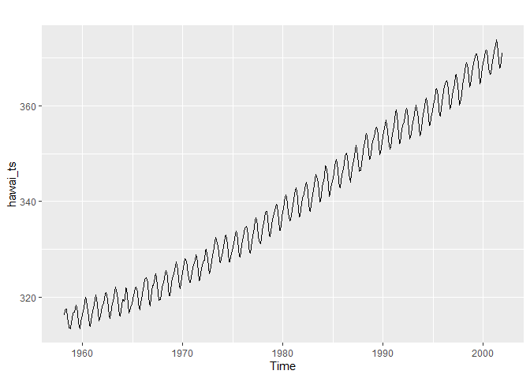
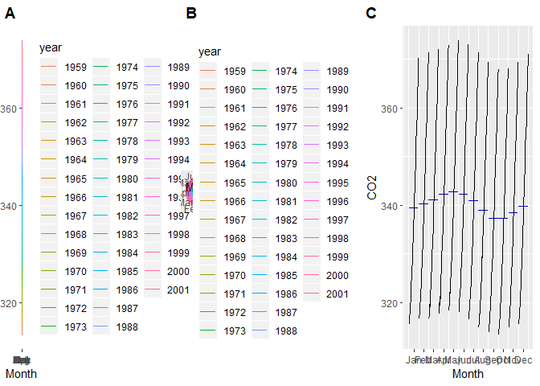
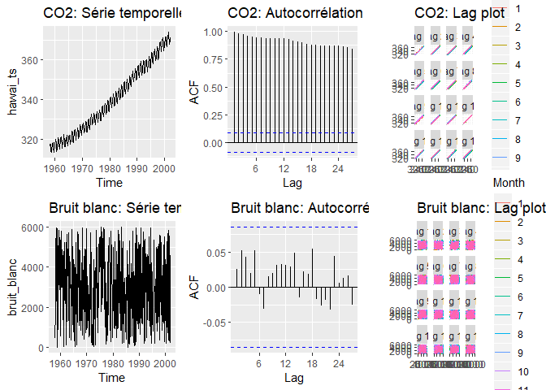
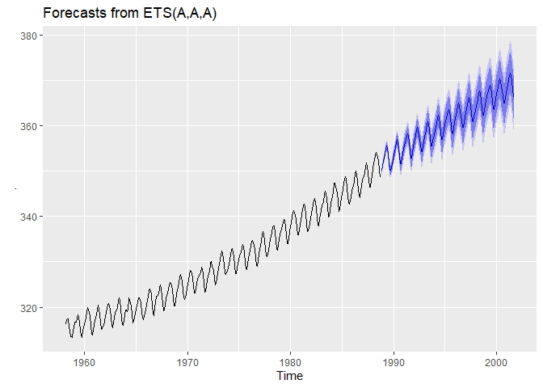
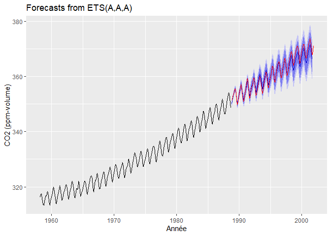
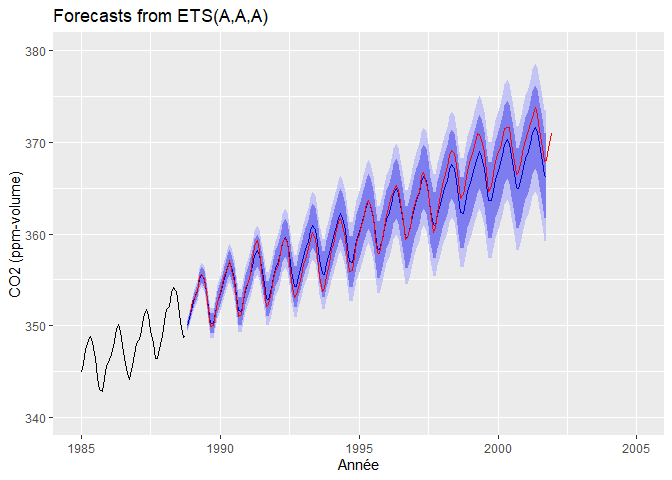
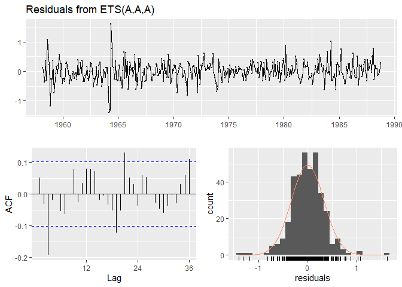

Séries temporelles et reproductibilité
================
Charles Frenette-Vallières
30/04/2020

## Introduction

Voici un travail réalisé dans le cadre du cours GAA7007 - Analyse et
modélisation d’agroécosystèmes de l’Université Laval, pour le
professeur Serge-Étienne Parent.

L’objectif de ce travail consiste à faire l’analyse de l’évolution du
CO2 atmosphérique au Mauna Loa Observatory à Hawaii, de mars 1958 à
décembre 2001. Le fichier `hawai.csv` comprend les moyennes des mesures
mensuelles du CO2 atmosphérique en ppm-volume.

Voici les étapes de ce travail :

  - 1.  créer une série temporelle du CO2 à partir des données de
        hawai.csv

  - 2.  séparer la série en parties d’entraînement (environ 70% des
        données) et en partie test

  - 3.  créer un modèle ETS sur les données d’entraînement, puis
        projeter la prévision de CO2 atmosphérique pour comparer aux
        données test

  - 4.  effectuer une analyse des résidus

  - 5.  commenter: le modèle est-il fiable? Comment pourrait-il être
        amélioré?

De plus, le présent code en R-markdown doit être déposé dans un
répertoire git.

Pour ce travail, les librairies suivantes seront utilisées :

  - `tidyverse` pour la manipulation et la représentation des tableaux
    de données
  - `forecast` et `fpp2` pour les modèles prévisionnels
  - `cowplot` pour compléter les graphiques `ggplot` inclus dans
    `tidyverse`

<!-- end list -->

``` r
library("tidyverse")
library("forecast")
library("fpp2")
library("cowplot")
```

## 1\. Créer une série temporelle du CO2

Le première étape consiste à créer une série à partir du fichier
`hawai.csv`. Après une analyse visuelle des données qui ne montre aucune
erreur flagrante, on peut importer le fichier de données. En général,
pour les donnes de dates, la librairie `lubridate` est très utile, mais
ici, puisque les données sont déjà en format décimal, ce n’est pas
nécessaire et on utilisera la fonction de base `ts`.

Importons d’abord le fichier. La fonction `skim` de la librairie `skimr`
nous permet de faire une observation préliminaire du fichier de données,
ou on peut constater qu’il n’y a aucune valeur manquante et que la
distribution semble adéquate.

``` r
hawai <- read_csv("data/hawai.csv")
skimr::skim(hawai)
```

|                                                  |       |
| :----------------------------------------------- | :---- |
| Name                                             | hawai |
| Number of rows                                   | 526   |
| Number of columns                                | 2     |
| \_\_\_\_\_\_\_\_\_\_\_\_\_\_\_\_\_\_\_\_\_\_\_   |       |
| Column type frequency:                           |       |
| numeric                                          | 2     |
| \_\_\_\_\_\_\_\_\_\_\_\_\_\_\_\_\_\_\_\_\_\_\_\_ |       |
| Group variables                                  | None  |

Data summary

**Variable type: numeric**

| skim\_variable | n\_missing | complete\_rate |    mean |    sd |      p0 |     p25 |     p50 |     p75 |    p100 | hist  |
| :------------- | ---------: | -------------: | ------: | ----: | ------: | ------: | ------: | ------: | ------: | :---- |
| time           |          0 |              1 | 1980.04 | 12.67 | 1958.17 | 1969.10 | 1980.04 | 1990.98 | 2001.92 | ▇▇▇▇▇ |
| CO2            |          0 |              1 |  339.61 | 17.12 |  313.40 |  324.02 |  337.91 |  354.54 |  373.80 | ▇▆▅▆▃ |

On peut maintenant créer la série temporelle du CO2 en utilisant la
fonction `ts`. On connait déjà la fréquence de mesures (mensuelles),
donc le paramètre `frequency` sera égal à 12. Pour le début de la série
temporelle (start), on utilise la valeur minimale de la colonne de temps
du fichier de données.

``` r
min(hawai$time)
```

    ## [1] 1958.167

``` r
hawai_ts <- ts(hawai %>% select(-time),
               start = c(1958.167, 1),
               frequency = 12)
```

On peut maintenant observer la distribution de la série temporelle. À
première vue, on peut voir une superposition d’ondulation cyclique
(probablement une variation annuelle due aux saisons) et une
augmentation graduelle de la concentration dans le temps.

``` r
autoplot(hawai_ts)
```

<!-- -->

On peut aussi faire une analyse de la distribution cyclique des données
pour visualiser les effets saisonniers ainsi que la tendance d’évolution
globale.

``` r
ggA <- ggseasonplot(window(hawai_ts[, 1], 1959, 2002)) + ggtitle("")
ggB <- ggseasonplot(window(hawai_ts[, 1], 1959, 2002), polar = TRUE) + ggtitle("")
ggC <- ggsubseriesplot(window(hawai_ts[, 1], 1959, 2002), polar = TRUE) + ggtitle("") + labs(y="CO2")

plot_grid(ggA, ggB, ggC, ncol = 3, labels = c("A", "B", "C"))
```

<!-- -->

``` r
ggsave2("images/hawai_cyclique.png", width = 16, height = 4)
```

Dans la figuire suivante, on peut voir le même graphique mais avec une
résolution plus lisible.


Dans le graphique A, on peut voir que pour chaque année, la variation de
concentration du CO2 est sinusoïdale, mais qu’elle augmente légèrement à
chaque année.

Dans le graphique B, on peut voir la même évolution, mais sur un cercle.
Comme on peut le voir, la concentration augmente en spirale au fil des
ans.

Dans le graphique C, on peut voir la moyenne mensuelle sur toutes les
années, ainsi que l’étendue des valeurs pour chaque mois. Encore une
vois, on voit le cycle sinusoïdal des données.

On peut aussi vérifier l’autocorrélation de la série temporelle. Dans le
code suivant, on crée d’abord un fichier de bruit blanc pour comparer,
puis on fait des graphiques montrant la série temporelle,
l’autocorrélation et le lag plot pour le fichier de CO2 et le bruit
blanc.

``` r
set.seed(62453)
bruit_blanc <- ts(runif(526, 0, 6000), start = c(1958, 1), frequency = 12)

plot_grid(autoplot(hawai_ts) + ggtitle("CO2: Série temporelle"),
          ggAcf(hawai_ts) + ggtitle("CO2: Autocorrélation"),
          gglagplot(hawai_ts) + ggtitle("CO2: Lag plot"),
          autoplot(bruit_blanc) + ggtitle("Bruit blanc: Série temporelle"),
          ggAcf(bruit_blanc) + ggtitle("Bruit blanc: Autocorrélation"),
          gglagplot(bruit_blanc) + ggtitle("Bruit blanc: Lag plot"),
          ncol = 3)
```

<!-- -->

``` r
ggsave2("images/hawai_autocorrelation.png", width = 15, height = 10)
```


Comme on peut le voir, l’autocorrélation est très forte pour le CO2,
dépassant largement le seuil de 0.95, contrairement au bruit blanc.
D’ailleurs, avec le test de Ljung, on peut voir que la p-value est
excessivement faible (p-value \< 2.2e-16), donc l’autocorrélation est
acceptée.

``` r
Box.test(hawai_ts, lag = 20, type = "Ljung-Box")
```

    ## 
    ##  Box-Ljung test
    ## 
    ## data:  hawai_ts
    ## X-squared = 9325.2, df = 20, p-value < 2.2e-16

## 2\. Séparer en partie d’entraînement et en partie test

Avant d’appliquer un modèle prévisionnel, on sépare le fichier de
données en partie d’entraînement et en partie test. La partie
d’entraînement représente généralement environ 70% des données et est
utilisée pour entraîner le modèle. Par la suite, on fait rouler le
modèle pour tenter de faire la prévision des données appartenant à la
partie test; cette partie permet donc de vérifier l’efficacité du modèle
prévisionnel.

Pour séparer les parties, on commence par déterminer l’étendue des
données, puis de marquer un seuil à 70%.

``` r
hawai_min <- min(hawai$time)
hawai_max <- max(hawai$time)
hawai_70 <- (hawai_max - hawai_min)*0.7 + hawai_min
hawai_70
```

    ## [1] 1988.792

``` r
hawai_70 + 1/12
```

    ## [1] 1988.875

Ainsi, toutes les données dont le temps est inférieur ou égal à 1988.792
feront partie de la partie d’entraînement, et toutes les données
supérieures ou égales à 1988.875 feront partie de la partie de test. La
commande suivante permet de créer ces parties.

``` r
haw_ts_train <- window(hawai_ts, start = 1958.166, end = 1988.792)
haw_ts_test <- window(hawai_ts, start =  1988.875, end = 2001.917)
```

## 3\. Créer un modèle ETS sur les données d’entraînement

On peut maintenant créer un modèle ETS sur les données d’entraînement.
Cette méthode permet d’intégrer les effets d’erreurs, de tendances et de
saisons (E, T et S) dans la prévision, ce qui la rend robuste dans le
cas de variables qui évoluent de façon saisonnière et qui ont une
tendance comme pour les mesures de CO2 dans notre fichier de données. La
fonction `ets` permet d’optimiser les types de modèles pour ces trois
facteurs selon les données. Cette fonction fait cette optimisation de
façon automatique, ce qui rend l’élaboration d’un modèle prévisionnel
très simple et rapide.

Dans la fonction de prévision `forecast`, on attribue un `h` de 13\*12,
puisqu’on souhaite faire une prévision sur environ 13 ans (entre 1989 et
2002), avec 12 valeurs par année (données mensuelles).

``` r
haw_ets <- haw_ts_train %>%
  ets() %>%
  forecast(h = 13*12)
haw_ets %>%
  autoplot()
```

<!-- -->

Visuellement, le modèle ETS semble avoir très bien fonctionné. Il
préserve les cycles saisonniers, ainsi que la tendance croissante.

On peut maintenant projeter cette prévision sur les données originales
afin de vérifier si les prévisions sont exactes.

``` r
autoplot(haw_ets) +
  autolayer(haw_ts_test, color = "red") +
  labs(x = "Année", y = "CO2 (ppm-volume)")
```

<!-- -->

Comme on peut le voir dans le graphique précédent, la prévision (en
bleu) englobe très bien la partie test des données (ligne rouge). Le
graphique suivant montre la même information mais en rapproché pour bien
voir l’exactitude de la prévision.

``` r
autoplot(haw_ets) +
  autolayer(haw_ts_test, color = "red") +
  labs(x = "Année", y = "CO2 (ppm-volume)") +
  xlim(1985, 2005) +
  ylim(340, 380)
```

    ## Scale for 'x' is already present. Adding another scale for 'x', which will
    ## replace the existing scale.

<!-- -->

## 4\. Analyse des résidus

On peut maintenant faire une analyse des résidus.

``` r
haw_ets %>%
  checkresiduals()
```

<!-- -->

    ## 
    ##  Ljung-Box test
    ## 
    ## data:  Residuals from ETS(A,A,A)
    ## Q* = 45.022, df = 8, p-value = 3.645e-07
    ## 
    ## Model df: 16.   Total lags used: 24

On peut voir que le type de modèle ETS utilisé est un modèle (A, A, A).
Cela signifie que l’erreur, la tendance et la saison sont toutes de type
additive.

Comme on peut le voir, le test de Ljung donne une p-value de 3.645e-07,
ce qui est excellent (bien en deçà du seuil de 0.05 généralement
accepté). Le graphique en histogramme des résidus montre une courbe qui
se rapproche beaucoup de la courbe normale, bien qu’elle soit légèrement
plus mince que celle-ci. En général, cette analyse nous permet
d’accepter avec confiance la validité du modèle prévisionnel.

## 5\. Commenter le modèle

Comme il vient d’être mentionné, on peut considérer que le modèle est
très fiable. Par contre, il aurait été possible de l’améliorer encore
davantage en utilisant un modèle dynamique. En effet, ces modèles
permettent d’utiliser des covariables pour améliorer les prévisions.
Puisque certaines covariables sont dépendantes, les écarter comme nous
l’avons fait ne permet pas une puissance prévisionnelle aussi forte.

Dans le cas du CO2, certaines covariables telles que la température, la
pression atmosphérique, la concentration d’autres gaz dans l’atmosphère,
la couverture végétale, les précipitations ou certains facteurs humains
tels que le nombre de véhicules, l’utilisation du territoire ou bien
d’autres auraient pu améliorer le modèle. En climatologie, de
nombreuses covariables sont généralement utilisés pour obtenir une
prévision plus juste (rugosité du sol, flux thermiques, vitesse du
vent, humidité, photopériode, etc.)

Par contre, dans le contexte actuel ou nous avions uniquement accès aux
données de concentrations de CO2, l’utilisation d’un modèle ETS était
sans doute optimale.
